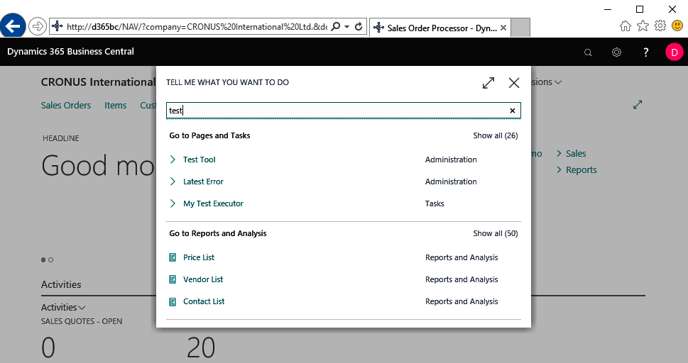

# Foreword

*Pages 6-7*

## Page 6

Foreword Testing code: often considered to be one of the least appealing parts of a developer's working life, perhaps second only to trying to hunt down, replicate, and fix bugs in your code. We know we should probably test more thoroughly but deadlines are tight and there is always something more interesting to work on.

Putting new bugs into the system is so much more fun than finding the ones that are already there, so we create a single-line sales order and sell a bicycle to Customer 10000 again. Most of us are developers because we like writing code.

We like learning about new techniques and technology. We don't like tracking down defects or re-testing code that we're pretty sure already works. What if we could write more code, learn some new techniques, spend less time chasing issues, and continually verify that our existing code still works? It's time to start writing and running some automated tests.

Over the last few versions of Microsoft Dynamics NAV, and now with Microsoft Dynamics 365 Business Central, the support for running automated tests has improved dramatically. Microsoft ships tens of thousands of tests with their standard products, and provide the tools for us to write and run our own.

However, all of this can be a little daunting at first. Where do we start? What should we test? Besides, who has the time to pick these practices up alongside their other work? Aren't we going to increase our overall development time by writing tests? How could we integrate them into our everyday work? We're going to need a guide.

For years, Luc van Vugt has been blogging, speaking at conferences, and training Dynamics NAV / Business Central developers. It's been my pleasure to attend several of his courses in the past. As a former Dynamics NAV tester at Microsoft, he has especially championed the cause of automated testing, pushing the community and Microsoft to adopt better practices.

He has written extensively about how to adapt and use the standard test toolkit to suit your needs and the needs of your customer. In this no-knowledge-assumed book, Luc guides us through the various stages of testing your application.

This will begin with translating your customer requirements into a series of unambiguous given-when-then scenarios that define and document the expected behaviour of the system, and then turning those scenarios into maintainable test code and running those tests to verify that your code still works as required.

## Page 7

Follow Luc as he guides us into the testing jungle and reassures us that the journey is manageable, will improve the quality of our code, and – say it quietly – may even be fun. Enjoy his relaxed and knowledgeable writing style, and get Hands-On with Automated Testing in Microsoft Dynamics 365 Business Central.

James Pearson​ Product Manager, Clever Dynamics. 

---

**Chapter Statistics:**
- Pages: 2
- Words: ~470
