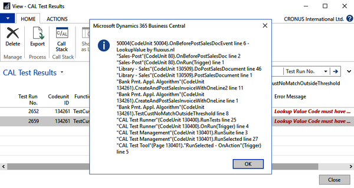
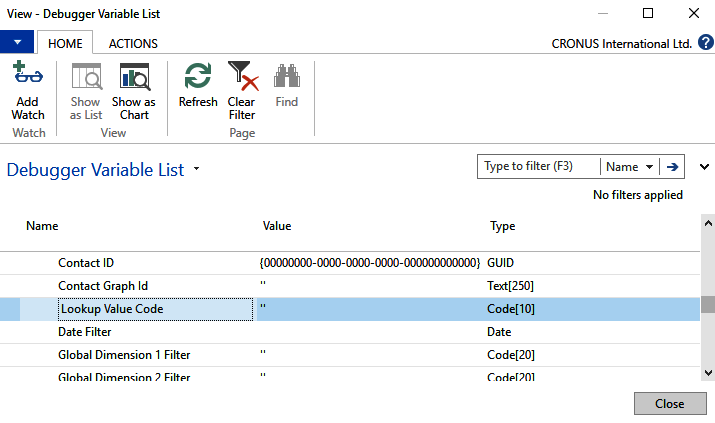

# Preface

*Pages 16-20*

## Page 16

Preface With recent changes, not least the evolution of Microsoft Dynamics NAV into Dynamics 365 Business Central, your development practices need to become more formal. Your success will depend, more than ever before, on your ability to determine the quality of your work more quickly and more consistently.

Traditional, that is, manual testing practices will not be sufficient anymore. So, you need to learn automated testing and how to efficiently include this in your daily work. In this book, you will learn how it will enhance your work, functionally and technically, and hopefully learn to love it.

Who this book is for This book is for developers, development managers, testers, functional consultants, and power users working with Microsoft Dynamics 365 Business Central or Dynamics NAV. The reader is assumed to have a general understanding of Dynamics 365 Business Central as an application and how this application can be extended.

Even though some sections will be dedicated to the coding of automated tests, it's not mandatory to be able to write code for Dynamics 365 Business Central. Overall, it sure gives the reader an advantage to be able to think as a tester.

What this book covers Chapter 1, Introduction to Automated Testing, introduces you to automated testing: why you would want to use it, what it exactly entails, and when you should use it. Chapter 2, The Testability Framework, elaborates on how Microsoft Dynamics 365 Business Central enables you to run automated tests, and what this so-called Testability Framework actually is by describing its five pillars.

Chapter 3, The Test Tool and Standard Tests, introduces the testing tool that resides in Dynamics 365 Business Central and allows you to run tests. Alongside that, we will discuss the standard tests and test libraries that Microsoft provides with Dynamics 365 Business Central.

Chapter 4, Test Design, discusses a couple of concepts and design patterns that allow you to conceive your tests more effectively and efficiently. 

## Page 17

Preface [ 2 ] Chapter 5, From Customer Wish to Test Automation - The Basics, teaches you – and allows you to practice, based on a business case – how to get from a customer's requirement to the implementation of automated tests.

In this chapter, you will make use of standard test libraries and techniques discussed in the previous chapters. The examples in this chapter will teach you the basics of headless and UI testing, and how to handle a positive-negative test.

Chapter 6, From Customer Wish to Test Automation - Next Level, continues the business case from Chapter 5, From Customer Wish to Test Automation - The Basics, and introduces some more advanced techniques: how to make use of shared fixtures, how to parameterize tests, and how to handle UI elements and hand over variables to these so-called UI handlers.

Chapter 7, From Customer Wish to Test Automation - And Some More, includes two more examples and continues with the same business case from the previous two chapters: how to go about testing a report and how to set up tests for a more complex scenario.

Chapter 8, How to Integrate Test Automation in Daily Development Practice, discusses a number of best practices that might turn out to be beneficial for you and your team in getting test automation up and running in your day-to-day work.

Chapter 9, Getting Business Central Standard Tests Working on Your Code, discusses why you would want to use the standard test collateral Microsoft provides with Dynamics 365 Business Central, and how to fix errors when standard tests fail due to your extension of the standard application.

Appendix A, Test-Driven Development, gives a short description of what Test-Driven Development (TDD) is and points out parts that can be of value to your daily development practices too. Appendix B, Setting Up VS Code and Using the GitHub Project, pays attention to VS Code and AL development, and the code examples to be found in the repository on GitHub.

To get the most out of this book This book is an introduction to test automation for Dynamics 365 Business Central. On one hand, various concepts and terminology are discussed, and on the other hand, we will also practice them by coding tests.

To get the most out of this book, you might want to practice what is preached by implementing the code examples discussed. As this book, however, does not cover how to program against Business Central, you might first want to read the tips given in Appendix B, Setting Up VS Code and Using the GitHub project.

## Page 18

Preface [ 3 ] If your learning style is to start by finding out the principles, terminology, and concepts, start reading Chapter 1, Introduction to Automated Testing, and move slowly into the more practical Section 3: Designing and Building Automated Tests for Microsoft Dynamics 365 Business Central.

If your style is more learning by doing, you could dare to take a deep dive into Chapter 5, From Customer Wish to Test Automation - The Basics, Chapter 6, From Customer Wish to Test Automation - Next Level, and Chapter 7, From Customer Wish to Test Automation - And Some More, straight away, and read the various backgrounds later or while working through the chapters.

Download the example code files You can download the example code files for this book from your account at www.packt.com. If you purchased this book elsewhere, you can visit www.packt.com/support and register to have the files emailed directly to you.

You can download the code files by following these steps: Log in or register at www.packt.com. 1. Select the SUPPORT tab. 2. Click on Code Downloads & Errata. 3. Enter the name of the book in the Search box and follow the onscreen 4.

instructions. Once the file is downloaded, please make sure that you unzip or extract the folder using the latest version of: WinRAR/7-Zip for Windows Zipeg/iZip/UnRarX for Mac 7-Zip/PeaZip for Linux The code bundle for the book is also hosted on GitHub at https:/​/​github.​com/ PacktPublishing/​Automated-​Testing-​in-​Microsoft-​Dynamics-​365-​Business-​Central.

In case there's an update to the code, it will be updated on the existing GitHub repository. 

## Page 19

Preface [ 4 ] Download the color images We also provide a PDF file that has color images of the screenshots/diagrams used in this book. You can download it here: http:/​/​www.​packtpub.​com/​sites/​default/​files/ downloads/​9781789804935_​ColorImages.​pdf.

Conventions used There are a number of text conventions used throughout this book. CodeInText: Indicates code words in text, database table names, folder names, filenames, file extensions, pathnames, dummy URLs, user input, and Twitter handles.

Here is an example: "The only step to be taken is to add the following code to the relevant Initialize function." A block of code is set as follows: fields { field(1; Code; Code[10]){} field(2; Description; Text[50]){} } When we wish to draw your attention to a particular part of a code block, the relevant lines or items are set in bold: [FEATURE] LookupValue Customer [SCENARIO #0001] Assign lookup value to customer [GIVEN] A lookup value [GIVEN] A customer Bold: Indicates a new term, an important word, or words that you see onscreen.

For example, words in menus or dialog boxes appear in the text like this. Here is an example: "Select System info from the Administration panel." Warnings or important notes appear like this. Tips and tricks appear like this.

## Page 20

Preface [ 5 ] Get in touch Feedback from our readers is always welcome. General feedback: If you have questions about any aspect of this book, mention the book title in the subject of your message and email us at customercare@packtpub.com.

Errata: Although we have taken every care to ensure the accuracy of our content, mistakes do happen. If you have found a mistake in this book, we would be grateful if you would report this to us. Please visit www.packt.com/submit-errata, selecting your book, clicking on the Errata Submission Form link, and entering the details.

Piracy: If you come across any illegal copies of our works in any form on the Internet, we would be grateful if you would provide us with the location address or website name. Please contact us at copyright@packt.com with a link to the material.

If you are interested in becoming an author: If there is a topic that you have expertise in and you are interested in either writing or contributing to a book, please visit authors.packtpub.com. Reviews Please leave a review.

Once you have read and used this book, why not leave a review on the site that you purchased it from? Potential readers can then see and use your unbiased opinion to make purchase decisions, we at Packt can understand what you think about our products, and our authors can see your feedback on their book.

Thank you! For more information about Packt, please visit packt.com. 

---

**Chapter Statistics:**
- Pages: 5
- Words: ~1,454
