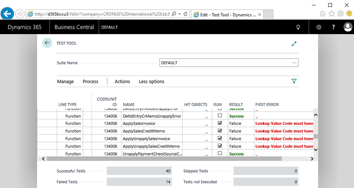

## The five pillars of the testability framework

*Pages 37-49*

## Page 37

The Testability Framework Chapter 2 [ 22 ] The five pillars of the testability framework In the following five sections, each pillar will be discussed and illustrated with a simple code example. Feel free to try them out yourself.

But, of course, being a hands-on book, we will get to a lot of more relevant examples later on. The code examples can be found on GitHub at https:/​/​github.​com/ PacktPublishing/​Automated-​Testing-​in-​Microsoft-​Dynamics-​365Business-​Central.

Details on how to use this repository and how to set up VS Code are discussed in Appendix B, Setting Up VS Code and Using the GitHub Project. Pillar 1 – Test codeunits and test functions Goal: Understand what test codeunits and test functions are and learn how to build and apply them.

The foremost important pillar of the testability framework is the concept of test codeunits and test functions. Test codeunits A test codeunit is defined by its Subtype: codeunit Id MyFirstTestCodeunit { Subtype = Test; } This makes it different from a standard codeunit in a couple of ways: It can contain the so-called test and handler functions next to the normal functions we are used to when writing app code When executing a test codeunit, the platform will do the following: Run the OnRun trigger and each test function that resides in the test codeunit, from top to bottom Record the result of each test function.

## Page 38

The Testability Framework Chapter 2 [ 23 ] Test functions A Test function is defined by the FunctionType tag: [Test] procedure MyFirstTestFunction() begin end; This makes it different from a standard function: It has to be global It cannot have arguments It yields a result, which is either SUCCESS or FAILURE When SUCCESS is returned by a test, it means that no error occurred in the execution of the test.

Consequently, when FAILURE is returned, the test execution did throw an error. This error could be due to various reasons, such as the following: Code execution hitting a TestField, FieldError, or Error call Data modifications not being fulfilled because of version conflicts, primary key conflicts, or locks The latter, a Test function returning FAILURE, brings us to another typicality of a test codeunit—when a test fails, the execution of a test codeunit doesn't halt.

It continues to execute the next Test function. Let's build two simple tests, one returning SUCCESS and the other FAILURE: codeunit 60000 MyFirstTestCodeunit { Subtype = Test; [Test] procedure MyFirstTestFunction() begin Message('MyFirstTestFunction'); end; [Test] procedure MySecondTestFunction() begin Error('MySecondTestFunction'); end; }.

## Page 39

The Testability Framework Chapter 2 [ 24 ] Now you can run them. As test functions are executed from top to bottom, the message thrown by MyFirstTestFunction will show the following screenshot first: After that, the following message is shown, being a resume message of the execution of the whole test codeunit: Note that the error did not appear like a message box, but is collected by the platform and recorded as part of the result of the failing test.

To be able to run the test codeunit, I built a simple page, MyTestsExecutor, with an action calling MyFirstTestCodeunit: page 60000 MyTestsExecutor { PageType = Card; ApplicationArea = All; UsageCategory = Tasks; Caption = 'My Test Executor';.

## Page 40

The Testability Framework Chapter 2 [ 25 ] actions { area(Processing) { action(MyFirstTestCodeunit) { Caption = 'My First Test Codeunit'; ToolTip = 'Executes My First Test Codeunit'; ApplicationArea = All; Image = ExecuteBatch; RunObject = codeunit MyFirstTestCodeunit; } } } } If you are following me using the code on GitHub and have a hard time opening the MyTestsExecutor page, use any of the following options: Set startupObjectType to Page and startupObjectId to 60000 in the launch.json Add?page=6000 to the web client URL in the address bar of your browser: http://localhost:8080/BC130/?page=6000 Use Alt + Q, Tell me what you want, in the web client and search for My Test Executor Launch the page directly from the VS Code, making use of a VS Code AL extension such as CRS AL Language Extension Pillar 2 – asserterror Goal: Understand what the asserterror keyword means and learn how to apply it.

A substantial part of the business logic we implement specifies conditions under which a user action or a process should fail or stop to continue its execution. Testing the circumstances that lead to this failure are as important as testing the successful conclusion of an action or process.

The second pillar allows us to write tests that are focused on checking whether errors do occur; a so called positive-negative or rainy path test. For example, that posting errors out because a posting date has not been provided, or that, indeed, a negative line discount percentage cannot be entered on a sales order line.

To achieve this, the asserterror keyword should be applied in front of the calling statement: asserterror <calling statement>

## Page 41

The Testability Framework Chapter 2 [ 26 ] Let's use it in a new codeunit and run it: codeunit 60001 MySecondTestCodeunit { Subtype = Test; [Test] procedure MyNegativeTestFunction() begin Error('MyNegativeTestFunction'); end; [Test] procedure MyPostiveNegativeTestFunction() begin asserterror Error('MyPostiveNegativeTestFunction'); end; } The MyPostiveNegativeTestFunction function is reported as a SUCCESS, and, consequently, no error message is recorded: If the calling statement following the asserterror keyword throws an error, the system will continue executing the following statements.

However, if the calling statement does not throw an error, the asserterror statement will cause one: An error was expected inside an asserterror statement. Where asserterror enables the test to continue with the next statement, it will not check the error as such.

As we will see later, it is up to you to verify whether the expected did occur or not. If there is no verification on the specific error following the asserterror, any error will make your test pass. 

## Page 42

The Testability Framework Chapter 2 [ 27 ] If a successful positive-negative test does not report the error, this does not mean that the error did not occur. It is thrown, and, therefore, when a write transaction was performed, a rollback will happen.

Any data modifications will disappear. Pillar 3 – handler functions Goal: Understand what handler functions are and learn how to build and apply them. In our first test codeunit example, the Message statement results in the display of a message box.

Unless we want to wait until a user presses the OK button, this message box stays there forever, halting the full execution of our test run. In order to be able to have a fully automated test run, we need a way to deal with any user interactions, such as a message box, a confirm dialog, a report request page, or a modal page.

For this, handler functions, also known as UI handlers, have been conceived. Handler functions are a special type of function that can only be created in test codeunits, and aim at handling UI interactions that exist in the code under test.

Handler functions enable us to fully automate tests without the need of a real user to interact with them. As soon as specific UI interactions occur, and a handler has been provided for it, the platform takes care of calling the handler as a substitute for real user interactions.

Test function handler functions are defined by the FunctionType tag. The currently available values are shown in the following screenshot:

## Page 43

The Testability Framework Chapter 2 [ 28 ] Each handler function addresses a different type of user interaction object and needs different parameters to let it interact adequately with the platform. Let VS Code and the AL extension be your guide in finding the right signature for a handler function.

The following screenshot shows you the signature of a MessageHandler when you hover over the function name: In case of a MessageHandler function, the signature is the text the message box would show to the user.

Handing over this text to the MessageHandler enables you to determine if the right message was triggered. For a listing of the signature of each handler type, go to https:/​/​docs. microsoft.​com/​en-​us/​dynamics-​nav/​how-​to-​-​create-​handlerfunctions.

So, to get the Message statement handled automatically in our first test codeunit, we should create a MessageHandler function: [MessageHandler] procedure MyMessageHandler(Message: Text[1024]) begin end; But this is only half of the job, as this handler needs to be linked to the test that will execute the code calling Message one way or another.

The HandlerFunctions tag is used to do this. Each handler function needs to be called in a Test function and must be added to the HandlerFunctions tag as text. If multiple handlers are needed, these will make up a comma separated string: HandlerFunctions('Handler1[,Handler2,…]') Let's apply this to MyFirstTestFunction in a new codeunit and run it: codeunit 60002 MyThirdTestCodeunit {.

## Page 44

The Testability Framework Chapter 2 [ 29 ] Subtype = Test; [Test] [HandlerFunctions('MyMessageHandler')] procedure MyFirstTestFunction() begin Message(MyFirstTestFunction); end; [MessageHandler] procedure MyMessageHandler(Message: Text[1024]) begin end; } Instantly, rather than showing a message box first, the resume message of the execution of the whole test codeunit is shown: Any handler function you add to the HandlerFunctions tag must be called at least one time in the Test function.

If the handler is not called upon, because the user interactions it should handle don't happen, an error will be thrown by the platform, saying: The following UI handlers were not executed, listing the handlers not called upon.

Pillar 4 – Test runner and test isolation Goal: Understand what a test runner and its test isolation are and learn how to use and apply them. Given the previous three pillars, we are positioned to write test cases as follows: Using test codeunit and test functions Either sunny or rainy path, the latter by applying the asserterror keyword With fully automated execution addressing any user interactions by applying handler functions.

## Page 45

The Testability Framework Chapter 2 [ 30 ] Do we need more? As a matter of fact, yes, we do, as we need a way to do the following: Run tests stored in multiple codeunits, control their execution, and collect and 1.

secure the results Run tests in isolation, so that we can achieve the following: 2. Write transactions, in the end, do not alter the database we run the test on Each rerun of a test is done using the same data setup Both goals can be accomplished using a so-called TestRunner codeunit with a certain test isolation.

A test runner codeunit is defined by its Subtype and the isolation by its TestIsolation: codeunit Id MyTestRunnerCodeunit { Subtype = TestRunner; TestIsolation = Codeunit; } Test runner Like any other codeunit, a test runner codeunit can have a OnRun trigger and normal userdefined functions, but, in addition to that, you can also add two test runner-specific triggers called OnBeforeTestRun and OnAfterTestRun.

When test codeunits are called from the OnRun trigger of a test runner, OnBeforeTestRun and OnAfterTestRun will be triggered by the system as follows: OnBeforeTestRun: This is triggered before the test codeunit is called, the test codeunit OnRun trigger is executed, and each of its test functions is run OnAfterTestRun: This is triggered after each test function has run and the test codeunit finishes Use the OnBeforeTestRun trigger to perform a test run pre-initialization and control the execution of a whole test codeunit and individual test functions.

The latter can be achieved by using the Boolean return value of the OnBeforeTestRun trigger. Returning TRUE, the test codeunit or test function runs. Returning FALSE, it is skipped. Use the OnAfterTestRun trigger to perform post-processing, such as logging the result of each test.

When the OnAfterTestRun trigger is run, the standard result message box, as we have seen so far, is not shown. 

## Page 46

The Testability Framework Chapter 2 [ 31 ] Both OnBeforeTestRun and OnAfterTestRun are run in their own database transaction. This means that changes made to the database with each of these triggers are committed once their execution finishes.

Further reading can be found as follows: OnBeforeTestRun: https:/​/​docs.​microsoft.​com/​en-​us/​dynamics365/ business-​central/​dev-​itpro/​developer/​triggers/​devenv-​triggeronbeforetestrun OnAfterTestRun: https:/​/​docs.​microsoft.​com/​en-​us/​dynamics365/ business-​central/​dev-​itpro/​developer/​triggers/​devenv-​triggeronaftertestrun Test isolation With a test runner enabling us to control the execution of all tests in one run, we also need to have control of the data created in one test codeunit, so that it will not influence the results of the tests in the next test codeunit.

For this, the test codeunit TestIsolation property has been introduced, and it has three possible values: Disabled: When selecting this value, or not setting the TestIsolation property explicitly, as this is the default value, any database transaction will be effectuated; after the execution of tests triggered by the test runner, the database will have changed compared to before running the test runner Codeunit: When selecting this value, after a test codeunit execution has completed fully, all data changes made to the database will be reverted/rolled back Function: When selecting this value, when a single test function has completed, all data changes made to the database will be reverted/rolled back Related to this, it makes sense to share a couple of thoughts on running tests and their isolation: Test isolation applies to database transactions, but does not apply to changes 1.

made outside of the database, and to variables, including temporary tables With test isolation, Codeunit, or Function, all data changes will be rolled back, 2. even if they were explicitly committed using the AL Commit statement Running test codeunits outside of the test isolation, either Codeunit or 3.

Function of a test runner will effectuate any database transaction Using test isolation, Function will give extra overhead compared to Codeunit, 4. resulting in longer execution time, as with the ending of each test function, the database changes have to be reverted.

## Page 47

The Testability Framework Chapter 2 [ 32 ] Setting the test isolation to Function might be unwanted, as it fully disables 5. dependencies between test functions, which might be needed when, for an extended test scenario, intermediate results should be reported, and this has been achieved by a series of individual, but interdependent, test functions With the TestIsolation property of a test runner, we have control over how to 6.

revert data changes in a generic way; as we will later see, the test function TransactionModel tag allows us to have control of the transaction behavior of individual test functions Pillar 5 – Test pages Goal: Understand what test pages are and learn how to apply them when testing the UI.

The initial trigger for adding the testability framework to the platform was to get away from testing the business logic through the UI. The testability framework enabled headless, and thus faster, testing of the business logic.

And this is how the testability framework was implemented in NAV 2009 SP1. Pure headless testing. It included everything of the four pillars discussed so far, even though test isolation was implemented in a different way than it is today.

It was previously not possible to test the UI. Moving ahead, it became clear that sole headless tests excluded too much. How could we test business logic that typically resides on pages? For example, consider a product configurator in which options are displayed or hidden depending on values entered by the user.

So, with NAV 2013, Microsoft added the fifth pillar to the testability framework: test pages. A test page is a logical representation of a page and is strictly handled in memory displaying no UI. To define a test page, you need to declare a variable of the TestPage type: PaymentTerms: TestPage "Payment Terms"; A TestPage variable can be based on any page existing in the solution.

A test page allows you to mimic a user carrying out the following actions: Accessing the page Accessing its sub parts Reading and changing data on it Performing actions on it

## Page 48

The Testability Framework Chapter 2 [ 33 ] You can achieve this by using the various methods that belong to the test page object. Let's build a small codeunit in which we use a couple of them: codeunit 60003 MyFourthTestCodeunit { Subtype = Test; [Test] procedure MyFirstTestPageTestFunction() var PaymentTerms: TestPage "Payment Terms"; begin PaymentTerms.OpenView(); PaymentTerms.Last(); PaymentTerms.Code.AssertEquals('LUC'); PaymentTerms.Close(); end; [Test] procedure MySecondTestPageTestFunction() var PaymentTerms: TestPage "Payment Terms"; begin PaymentTerms.OpenNew(); PaymentTerms.Code.SetValue('LUC'); PaymentTerms."Discount %".SetValue('56'); PaymentTerms.Description.SetValue( PaymentTerms.Code.Value() ); ERROR('Code: %1 \ Discount %: %2 \Description: %3', PaymentTerms.Code.Value(), PaymentTerms."Discount %".Value(), PaymentTerms.Description.Value() ); PaymentTerms.Close(); end; } Note that errors are forced to get some useful feedback on the resume message of the test codeunit.

## Page 49

The Testability Framework Chapter 2 [ 34 ] So, we get the following as a result: For a complete listing of all test page methods, you can access the following URLs: TestPage: https:/​/​docs.​microsoft.​com/​en-​us/​dynamics365/​businesscentral/​dev-​itpro/​developer/​methods-​auto/​testpage/​testpage-​datatype TestField: https:/​/​docs.​microsoft.​com/​en-​us/​dynamics365/​businesscentral/​dev-​itpro/​developer/​methods-​auto/​testfield/​testfielddata-​type TestAction: https:/​/​docs.​microsoft.​com/​en-​us/​dynamics365/ business-​central/​dev-​itpro/​developer/​methods-​auto/​testaction/ testaction-​data-​type If you are running Microsoft 365 Business Central on-premises and you want to run tests using test pages, be sure that you have the Page Testability module installed:.

---

**Chapter Statistics:**
- Pages: 13
- Words: ~2,788
