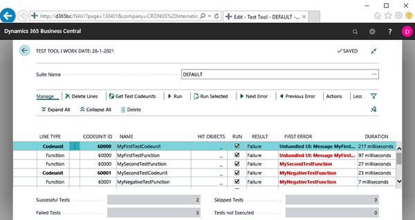

## Understanding test data setup design patterns

*Pages 71-74*

## Page 71

Test Design Chapter 4 [ 56 ] You may add a bunch of exclamation marks. You might have noticed that the ATDD design pattern has no equivalent of the teardown phase in the four-phase test design patterns. As mentioned, ATDD is user-oriented and the teardown is a more technical exercise.

But of course, if needed, a teardown section should be coded at the end of a test. For more information on ATDD you can go to the following links: https:/​/​en.​wikipedia.​org/​wiki/​Acceptance_​test%E2%80%93driven_ development or https:/​/​docs.​microsoft.​com/​en-​us/​dynamics365/ business-​central/​dev-​itpro/​developer/​devenv-​extension-​advancedexample-​test#describing-​your-​tests.

Understanding test data setup design patterns Goal: Learn the basic patterns for setting up test data. When you carry out your manual tests, you know that most of the time is consumed by setting up the right data.

Being a real IT pro, you will think up ways of doing this as efficiently as possible. You might have thought of making sure of the following: A basic setup of data is available, which will be the foundation for all of the tests you are going to execute For each feature under test, additional test data exists upfront Test specific data will be created on the fly This way you created yourself a number of patterns that help you efficiently get your test data setup done.

These are what we call test data setup design patterns, or fixture or test fixture design patterns, and each has its own name: The first one is what we call a prebuilt fixture. This is test data that is created before any of the tests are run.

In the context of Dynamics 365 Business Central, this will be a prepared database, such as CRONUS, the demo company that Microsoft provides. 

## Page 72

Test Design Chapter 4 [ 57 ] The second pattern is known as shared fixture, or lazy setup. This concerns the setup of data shared by a group of tests. In our Dynamics 365 Business Central context, this concerns generic master data, supplemental data, and setup data, such as customer and currency data and a rounding precision, all needed to run a group of tests.

The third and last pattern is fresh fixture, or fresh setup. This entails data particularly needed for a single test, such as an empty location, a specific sales price, or a document to be posted. When automating tests, we will make use of these patterns for the following reasons: Efficient test execution: Even though an automated test seems to run at the speed of light, building up a test collateral over the years will increase the total execution time, which might easily run into hours; the shorter the automated test run will be, the more it will be used Effective data setup: When designing test cases, it is straight away clear what data will be needed and at what stage; this will speed up the coding of the tests Read more on fixture patterns here: http:/​/​xunitpatterns.​com/​Fixture Setup Patterns.​html Note that there is much more to formalize in the test data setup.

In our test coding in the next chapters, we will utilize a couple more of the patterns mentioned. Test fixture, data agnostics, and prebuilt fixture As stated in the introductory chapter, automated tests are reproducible, fast, and objective.

They are reproducible in their execution as the code is always the same. But this does not guarantee whether the outcome is reproducible. If each time a test is run, the input to the test, that is, the data setup, is different, then presumably the output of the test will also be different.

The following three things help to ensure your tests are reproducible: Make a test run on the same fixture 1. Make a test follow the same code execution path 2. Make a test verify the outcome based on the same and sufficient set of criteria 3.

## Page 73

Test Design Chapter 4 [ 58 ] To have full control on the fixture, it is highly preferable to let your automated tests create the data they need anew, with each run. In other words, do not rely on the data present in the system before tests are run.

Automated tests should be agnostic of any data residing in the system under test. Consequently, running your tests in Dynamics 365 Business Central should not rely on the data present in the database, be it CRONUS, your own demo data, or customer-specific data.

Yes, you might need customer specific data to reproduce a reported issue, but once fixed and the test automation is updated, it should be able to run data agnostically. Because of this, we will not use the prebuilt fixture pattern in any of our tests.

If you've ever run the standard tests, you might have noticed that quite a number of them are not data agnostic. They highly rely on the data present in CRONUS. You might also have noticed that this applies to the older tests.

At present, standard tests strive to be data agnostic. Test fixture and test isolation To start each set of tests with the same fixture, we will take advantage of the test isolation feature of the test runner codeunit, as discussed in Chapter 2, The Testability Framework, in the Pillar 4 - test runner and test isolation section.

Using the test isolation value codeunit of the standard test runner and putting a coherent set of tests in one test codeunit, a generic teardown for the whole test codeunit is set. It will assure that, at the termination of each test codeunit, the fixture is reverted to its initial state.

If the test runner utilizes the Function test isolation, it would add a generic teardown to each test function. Shared fixture implementation You might have observed in the two Microsoft test functions used as examples for the fourphase and ATDD patterns that each test starts with a call to a function named Initialize, right after the scenario description.

Initialize contains the standard implementation of the shared fixture pattern (next to a generic fresh fixture pattern we will elaborate on) as follows: local Initialize() // Generic Fresh Setup LibraryTestInitialize.OnTestInitialize(<codeunit id>); <generic fresh data initialization> // Lazy Setup if isInitialized then exit();.

## Page 74

Test Design Chapter 4 [ 59 ] LibraryTestInitialize.OnBeforeTestSuiteInitialize(<codeunit id>); <shared data initialization> isInitialized:= true; Commit(); LibraryTestInitialize.OnAfterTestSuiteInitialize(<codeunit id>); When calling Initialize at the start of each test function in the same test codeunit, the lazy setup part will just be executed once, since only with the first call to Initialize will the Boolean variable be false.

Note that Initialize also incorporates three hooks, that is event publishers, to allow extending Initialize by linking subscriber functions to it: OnTestInitialize OnBeforeTestSuiteInitialize OnAfterTestSuiteInitialize In Chapter 9, Getting Business Central Standard Tests Working on Your Code, we will specifically make use of these publishers.

The lazy setup part of Initialize is what xUnit patterns call SuiteFixture setup. Fresh fixture implementation A fresh fixture can be (partly) set up in a generic way as per the implementation in the Initialize function as discussed previously.

This is for data that needs to be created or cleaned out at the start of each test. A fresh setup specifically needed for one test only is what is to be found inline in the test function that implements the test, defined by the GIVEN tags.

The generic fresh setup part of Initialize is what xUnit patterns call Implicit Setup. The test specific fresh setup is called inline setup. 

---

**Chapter Statistics:**
- Pages: 4
- Words: ~1,230
