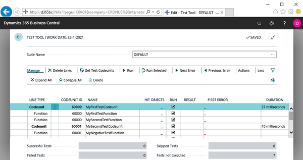

# Chapter 5: From Customer Wish to Test Automation - The Basics

*Pages 77-77*

## Page 77

5 From Customer Wish to Test Automation - The Basics We are technically fully set to start writing tests at this point. This is because we know how the testability framework functions, we know the test toolkit, we know about the existence of the standard test libraries, and we have been provided with various patterns to allow us to design efficient and effective tests.

But what are we going to test? What's our business case? What are the customer wishes we are going to implement? In this chapter, we will start applying the principles and techniques discussed in the previous chapters and we will build a number of basic automated tests.

As such, this chapter covers the following topics: Test example 1 – A first headless test Test example 2 – A first positive-negative test Test example 3 – A first UI test Headless versus UI

---

**Chapter Statistics:**
- Pages: 1
- Words: ~146
