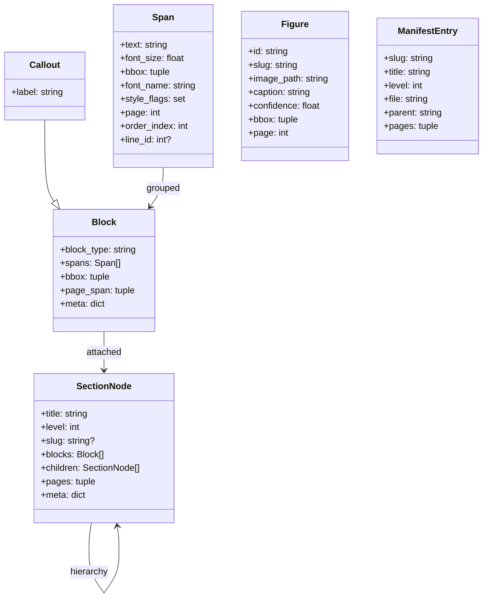
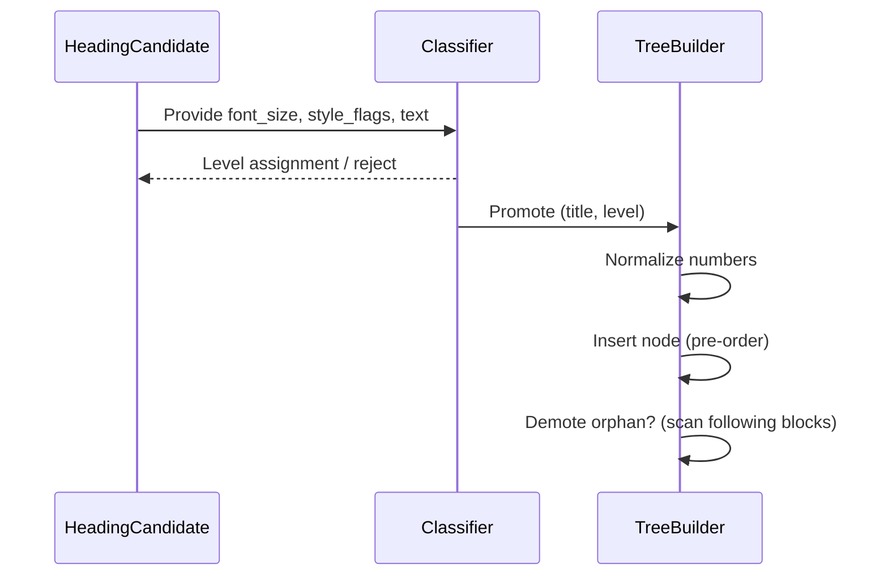
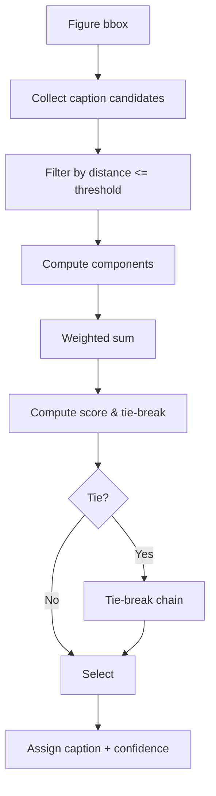
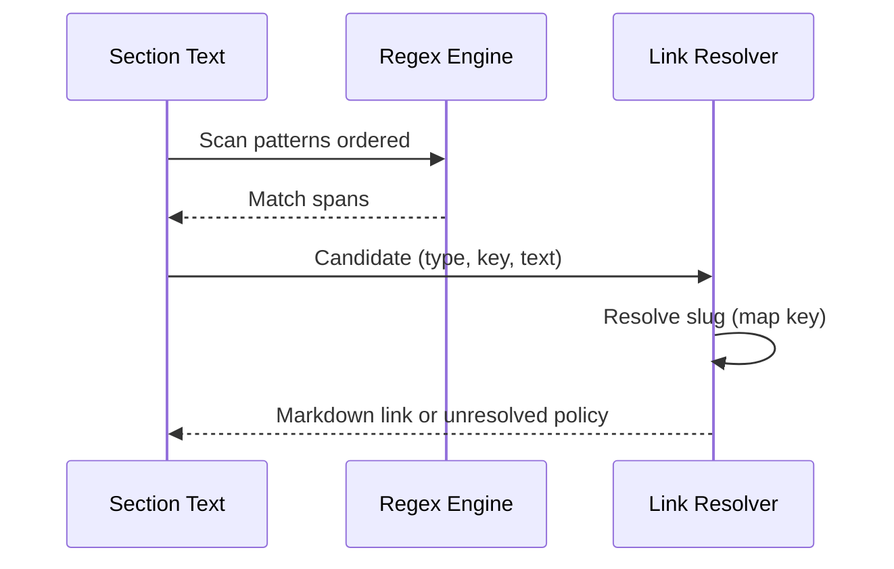

# pdf2md Design Specification (AI-Optimized)

<!-- markdownlint-disable  -->

Version: 0.1 Source Basis: PRD distilled into structured, machine-friendly form.

## 1. Purpose

Convert technical, text-based PDFs into a deterministic, multi-file,
semantically structured Markdown corpus (chapters, sections, lists, code,
tables, figures, footnotes, manifest, optional TOC) with high fidelity and
idempotent output.

Network policy: Offline by default. When `ai.enabled=true`, permit calls only
to explicitly configured AI provider endpoints (e.g., Azure OpenAI). All other
network calls remain disallowed. The tool supports both fully offline use and
optional online AI assistance when enabled.

## 2. High-Level Pipeline


### 2.1 Stage Contract Table

<!-- markdownlint-disable MD013 -->

| Stage | Input | Output | Primary Ops | Side Effects | Purity Level |
|-------|-------|--------|-------------|--------------|--------------|
| Ingestion | PDF bytes/pages | Raw layout objs | Extract glyphs, bbox, font | None | Pure |
| Normalization | Raw objs | Ordered Spans | Style flag derivation, coordinate rounding | None | Pure |
| Line & Hyphen Repair | Spans | Spans (line_id) | Merge lines, de-hyphenate | Replaces affected Spans | Deterministic |
| Block Assembly | Spans | Blocks | Paragraph grouping, list & code detection, callout label matching | Creates Block list | Deterministic |
| Heading Promotion | Blocks | SectionNodes + Blocks | Font tier clustering, heading candidate → sections | Mutates structure, not text | Deterministic |
| Numbering & Appendix | SectionNodes | Annotated nodes | Extract chapter/section paths, appendices | Meta only | Deterministic |
| Post-Processing | Section tree + Blocks | Augmented tree | Slugs, xrefs, captions, footnotes, noise prune | Adds meta, may drop noise | Deterministic |
| Rendering | Final tree | Markdown strings | Serialize blocks, file naming | Writes files | Deterministic (I/O) |
| Export | Render output | Manifest, TOC | Structural hash, asset copy | Writes JSON/YAML | Deterministic (I/O) |

<!-- markdownlint-disable MD013 -->

### 9.1 TOC Generation

The Table of Contents (TOC) is generated as a deterministic YAML projection of
the manifest sections. It extracts entries with `title` and `file` from each
ManifestEntry, ordered by pre-order `order_index`. Appendices are positioned
after chapters in the traversal.

**Key Invariants:**

- Deterministic via `order_index` sorting for consistent re-run output.
- Includes only sections where `level <= numbering_max_depth`.
- Excludes semantic elements like cross_references to preserve structural
  idempotency.

**Pseudo-Algorithm:**

```text
Traverse SectionNodes in pre-order using order_index;
for each node:
    if node.level <= config.numbering_max_depth:
        emit YAML: - title: {node.title}, file: {node.file}
Appendices (level == appendix_level) follow chapters per order_index.
```

See PRD [line 73](prd.md#L73) for optional generation via --toc and YAML
structure for MkDocs.

## 3. Core Data Model



### 3.1 Entity Field Summary

<!-- markdownlint-disable MD013 -->

| Entity | Required Fields | Key Invariants |
|--------|-----------------|----------------|
| Span | text, bbox, font_name, font_size, style_flags, page, order_index | order_index strictly increasing |
| Block | block_type, spans | Spans ordered by order_index |
| Callout | block_type, spans, meta[label] | label in ['Note', 'Tip', 'Warning']; spans ordered by order_index |
| SectionNode | title, level, blocks, children | Pre-order parent precedes children |
| Figure | id, image_path, page | id monotonic, caption optional |
| ManifestEntry | slug, file | Slug unique global |

<!-- markdownlint-enable MD013 -->

### 3.2 Block Types

Paragraph, List, ListItem, Callout, CodeBlock, Table, FigurePlaceholder,
FootnotePlaceholder, HeadingCandidate, EmptyLine, RawNoise.

**Note:** Callouts map to Markdown blockquotes with the label, e.g., ">
**Note:** ...". See PRD [line 89](prd.md#L89) for details on PRD cross-
reference.

## 4. Determinism Rules (Canonical)

1. Global Span ordering stable (page order → y → x or extractor intrinsic;
   captured in order_index).
2. All sorting explicit (order_index, numeric suffix, lexicographic fallback).
3. Slug = prefix(index, width) + slugified title; index from pre-order traversal
   ignoring demoted headings.
4. No random/clock/time usage; no unordered set iteration without sorting.
5. Structural hash excludes late-link cross references, resolved links,
   policies, and tool/version metadata to ensure core idempotency of the
   document structure.
6. Noise removal bounded by threshold; abort if drop ratio > configured maximum.
7. Caption scoring weight vector must sum to 1 ±1e-6 else CONFIG error.
8. Duplicate non-resolvable slugs → PARSE error -> abort.
9. Semantic hash (SHA-256 over a projection including cross_references, resolved
   links, and policies) ensures integrity of semantic enrichments like link
   resolution.

10. TOC serialization mirrors manifest pre-order, ensuring identical output on
re-run; excludes semantic elements like cross_references.

## 5. Heading & Numbering Logic (Condensed)

### 5.1 Normalization Rules

Global chapter numbering increments without resets; log
`chapter_number_reset_detected` and remap to N+1. Log `section_gap_detected`
without renumbering. Handle duplicates as implicit sequence via
`duplicate_chapter_number`.

### 5.2 Config Integration

Toggles: `numbering_allow_chapter_resets` (default false),
`numbering_validate_gaps` (default true), `numbering_max_depth` (default 6).

### 5.3 Pseudo-Algorithm

```text
global_chapter = 0
for heading in pre-order candidates:
    if matches Chapter N:
        if N < global_chapter:
            log reset
        global_chapter += 1
        meta.chapter_number = global_chapter
    elif matches Dotted Path:
        validate segments, log gaps if enabled
        meta.section_path = [int(s) for s in path.split('.')]
        truncate if depth > max_depth
```



For full detection order, data attachment, error/edge handling, and testing: See
PRD Section 10.2 [prd.md#L207](prd.md#L207).

**Invariants:** No title mutation; roman to decimal internal only.

## 6. Figure Caption Scoring

### 6.1 Scoring Components

- **S_pattern**: 1 if the candidate text matches the caption prefix regex (e.g.,
  "^(Figure|Fig\.)"), else 0.
- **S_position**: 1 if the candidate is positioned below the figure, 0.6 if
  overlapping, 0.4 if above.
- **S_distance**: Computed as \(1 - \frac{g}{\text{threshold}}\), where \(g\) is
  the vertical gap, clamped to ≥0.
- **S_font**: 1 if the font size ≤ median font size * ratio (default 0.92) or if
  italic style is present, else 0.4.

Default weights: pattern=0.35, position=0.25, distance=0.25, font=0.15.

### 6.2 Tie-Breaking

When scores tie (to 4 decimal places), apply the following hierarchy:

1. Higher S_pattern (prefer regex matches).
2. Smaller gap \(g\).
3. Direction priority: below > above > overlap (mapped to ranks 1, 2, 3).
4. Lexicographic order on normalized text (lowercase, stripped punctuation).

### 6.3 Pseudo-Formula

```python
from decimal import Decimal

score = Decimal('0').quantize(prec=6)
score += Decimal('0.35') * S_pattern
score += Decimal('0.25') * S_position
score += Decimal('0.25') * S_distance
score += Decimal('0.15') * S_font
confidence = float(score.quantize(prec=3))

if scores tie (to 4 decimals): apply tie-break chain
```

**Invariants:**

- Weights sum to 1 ±1e-6; validate in config or raise CONFIG error.
- Candidate ordering: (gap asc, direction_rank asc, order_index asc).

For pre-filtering, edge cases (e.g., shared captions), logging, and testing: See
PRD Section 10.5 [prd.md#L322](prd.md#L322).



## 7. Cross-Reference Normalization (XRef)

Patterns (default ordered): Chapter, Section, Fig, Appendix variants. Non-
overlapping longest-first at same index. Policies for unresolved:
annotate|keep|drop. Limit per section: `xref_max_per_section`.



## 8. Noise Filtering Policy

### 8.1 Taxonomy and Detection

Noise elements are classified based on location and repetition patterns:

- Running headers/footers in top/bottom bands (defined by `noise_header_top_px`
  and `noise_footer_bottom_px`).
- Page numbers matching the regex pattern `^(page\s+)?\d{1,4}$`.
- High-frequency watermarks or copyright notices across pages.

Detection focuses on normalized text frequency exceeding
`noise_min_repetition_ratio` and length under `noise_max_chars`.

### 8.2 Safety and Overrides

- **Allowlist/Blocklist**: Use `noise_keep_patterns` (regex) to retain potential
  noise matches; `noise_drop_patterns` (regex) to force removal.
- **Dry-Run Summary**: Output JSON summary of detected noise spans for review.
- **Abort Threshold**: If removals exceed `noise_max_drop_ratio` (e.g., 5%),
  raise `ParseError` with `'over_removal_abort'` to prevent excessive data loss.

### 8.3 Pseudo-Algorithm

```text
for page in pages:
    for span in page.spans:
        if in_band(span):  # top/bottom bands or other criteria
            norm = trim(lowercase(span.text))
            freq[norm] += 1
    ratio = freq[norm] / total_pages
```

```text
if ratio >= min_repetition and len(norm) < max_chars and not
keep_patterns.match(norm) and drop_patterns.match(norm):
    mark_remove(span)
if total_remove / total_spans > max_drop:
    raise ParseError('over_removal_abort')
```

**Invariants:**

- Evaluation order: frequency analysis → blocklist check → allowlist check.
- Executed after Normalization stage, before hyphen repair.
- Deterministic: Relies on stable `order_index` and config parameters; no random
  operations.

For full metrics, logging, and testing (e.g., synthetic pages): See PRD Section
10.X [`prd.md#L444`](prd.md#L444).

## 9. Manifest Schema

See [doc/manifest-schema.md](manifest-schema.md) for the full canonical manifest
schema.

### Appendix: Hash Bifurcation (Structural vs. Semantic)

The design emphasizes machine-friendly focus by distinguishing between
structural_hash (for core idempotency of document hierarchy, excluding semantic
enrichments like cross_references) and semantic_hash (for link integrity,
including cross_references, resolved links, and policies). Inputs as defined in
the canonical schema:

- **Structural hash**: JSON(minimal projection: sections, figures, footnotes)
  serialized with sorted keys, no extra whitespace. Ensures stability for core
  structure validation.
- **Semantic hash**: JSON(extended projection: sections, figures, footnotes,
  cross_references, resolved_links, policies) serialized with sorted keys, no
  extra whitespace. Verifies integrity of semantic enhancements.

This bifurcation addresses schema inconsistencies by retaining cross_references
for completeness while excluding them from structural_hash to maintain
idempotency. It promotes modularity, allowing independent validation of core
structure (structural_hash) from post-processing (semantic_hash), enabling
incremental updates without full recomputation.

## 10. Error & Exit Codes

<!-- markdownlint-disable MD013 -->
| Category | Exit | Code | Trigger | Severity | Trigger Stage | Escalation |
|----------|------|------|---------|----------|---------------|------------|
| CONFIG | 2 | config_parse_error | YAML/JSON load failure | Fatal | Config Load | N/A |
| CONFIG | 2 | config_invalid_value | Value outside allowed domain | Fatal | Config Load | N/A |
| CONFIG | 2 | config_weight_sum_invalid | Figure caption weights sum ≠ 1 ±1e-6 | Fatal | Config Load | N/A |
| CONFIG | 2 | config_regex_invalid | Supplied regex fails to compile | Fatal | Config Load | N/A |
| CONFIG | 2 | config_conflict | Mutually exclusive options | Fatal | Config Load | N/A |
| CONFIG | 2 | config_unknown_key | Extraneous key in strict mode | Fatal | Config Load | N/A |
| IO | 3 | pdf_unreadable | PDF load or parsing failure | Fatal | Ingestion | N/A |
| IO | 3 | output_path_unwritable | Cannot create/write output directory | Fatal | Export | N/A |
| IO | 3 | image_write_failed | Failed to write image file (all figures) | Fatal | Export | N/A |
| PARSE | 4 | unresolvable_slug_collision | Slug collision unresolvable after suffixes | Fatal | Post-Processing | N/A |
| PARSE | 4 | duplicate_slug_detected | Non-unique slug generated | Fatal | Post-Processing | N/A |
| PARSE | 4 | structural_hash_failure | Hash computation inconsistency | Fatal | Export | N/A |
| PARSE | 4 | over_removal_abort | Noise removal exceeds max drop ratio | Fatal | Noise Filtering | N/A |
| PARSE | 4 | numbering_strict_violation | Duplicate chapter/appendix when strict | Fatal | Numbering | Via numbering_error_strict=true |
<!-- markdownlint-disable MD013 -->
| GENERAL | 1 | unhandled_exception | Fallback for unexpected errors | Fatal | Any | N/A |
| WARN | - | chapter_number_reset_detected | Chapter numbering resets after part | Non-fatal | Numbering | Log and continue (global increment) |
| WARN | - | duplicate_chapter_number | Duplicate explicit chapter number | Non-fatal | Numbering | Log and use implicit sequence |
| WARN | - | section_gap_detected | Gaps in section numbering path | Non-fatal | Numbering | Log and continue |
| WARN | - | appendix_out_of_order | Appendix letters not sequential | Non-fatal | Appendix Detection | Log and retain original |
| WARN | - | appendix_duplicate_letter | Duplicate appendix letter | Non-fatal | Appendix Detection | Log and demote second to section |
| WARN | - | xref_unresolved | Unresolved cross-reference | Non-fatal | Post-Processing | Apply policy (annotate/keep/drop) |
<!-- markdownlint-enable MD013 -->
<!-- markdownlint-enable MD013 -->

```python
if error.category in ['CONFIG', 'IO', 'PARSE']:
    sys.exit(error.code)
else:
    log.warn(event)
    continue  # or handle per policy
```

**Note:** Full details, structured JSON objects, and escalation rules: See PRD
Section 15 [prd.md#L791](prd.md#L791).

## 11. Configuration (Consolidated Keys)

**Note:** The original keys listed first in the table below represent a Critical
Subset focused on core heuristics. The full table integrates all configuration
keys from PRD Section 12.1 for completeness.

<!-- markdownlint-disable MD013 -->

| Key | Type | Default | Validation | Impact |
|-----|------|---------|------------|--------|
| slug_prefix_width | int | 2 | >=1 | File ordering determinism |
| figure_caption_distance | int | 150 | >0 | Caption candidate radius |
| table_confidence_min | float | 0.5 | 0..1 | Accept vs fallback |
| noise_min_repetition_ratio | float | 0.6 | (0,1] | Noise classification |
| noise_max_drop_ratio | float | 0.05 | (0,0.5) | Abort threshold |
| demote_orphan_headings | bool | true | - | Structural pruning |
| xref_unresolved_policy | enum | annotate | enumerate | Link text handling |
| numbering_max_depth | int | 6 | >=1 | Section path truncation |
| appendix_level | enum | chapter | one-of | Hierarchy semantics |
| font_cluster_epsilon | float | 1.0 | <=0 | Max diff to merge font tiers in heading detection |
| min_heading_font_size | float/null | null | <0 | Override auto tier floor for heading classification |
| list_indent_tolerance | int | 6 | <0 | Pixel delta for same list level nesting |
| code_min_lines | int | 2 | <1 | Minimum lines to classify as code block |
| code_indent_threshold | int | 4 | <0 | Leading space count for code heuristic |
| exclude_pages | list[int] | [] | any <1 | Pages to skip entirely during processing |
| heading_normalize | bool | true | - | Normalize heading whitespace for consistency |
| linkify_cross_references | bool | true | - | Deprecated; maps to xref_enable for backward compatibility |
| image_format | enum | png | unsupported format | Output raster image format for figures |
| image_dpi | int | 200 | <50 | DPI for rasterization fallback in image extraction |
| footnote_merge | bool | true | - | Merge multiline footnotes into single block |
| language_detection | bool | false | - | Enable expensive code language inference |
| noise_header_top_px | int | 120 | <0 | Header band height for noise detection |
| noise_footer_bottom_px | int | 120 | <0 | Footer band height for noise detection |
| noise_max_chars | int | 80 | <1 | Max chars for noise candidate classification |
<!-- markdownlint-disable MD013 -->
| noise_keep_patterns | list[str] | [] | invalid regex | Regex allowlist to retain potential noise |
| noise_drop_patterns | list[str] | [] | invalid regex | Regex blocklist for forced noise removal |
| noise_protect_numeric_pages | list[int] | [] | any <1 | Pages to retain page numbers as non-noise |
| enable_watermark_removal | bool | false | - | Future toggle for watermark removal |
| figure_caption_prefer_below | bool | true | - | Bias below figure in caption tie-breaking |
| figure_caption_max_lines | int | 3 | <1 | Lines of caption text to score for binding |
| figure_caption_pattern | regex | ^(Figure&#124;Fig&#46;) | invalid regex | Caption prefix regex for detection |
| figure_caption_font_smaller_ratio | float | 0.92 | <=0 or >=1 | Size ratio for caption font detection |
| figure_caption_weight_pattern | float | 0.35 | negative | Scoring weight for pattern match in caption binding |
| figure_caption_weight_position | float | 0.25 | negative | Scoring weight for position in caption binding |
| figure_caption_weight_distance | float | 0.25 | negative | Scoring weight for distance in caption binding |
| figure_caption_weight_font | float | 0.15 | negative | Scoring weight for font in caption binding |
| figure_caption_strip_prefix | bool | true | - | Remove 'Figure n:' prefix from caption text |
| figure_caption_decimal_precision | int | 6 | <1 | Internal scoring precision for caption confidence |
| xref_enable | bool | true | - | Enable cross-reference normalization |
| xref_case_insensitive | bool | true | - | Case-insensitive pattern matching for xrefs |
| xref_max_per_section | int | 100 | <1 | Rate-limit resolved xrefs per section |
| xref_resolve_figures | bool | true | - | Enable figure reference resolution |
| xref_resolve_appendices | bool | false | - | Enable appendix reference resolution |
<!-- markdownlint-disable MD013 -->
| xref_patterns | list[regex] | [] | invalid regex | Override/extend default xref patterns |
| numbering_validate_gaps | bool | true | - | Warn on numbering gaps in sections |
| numbering_allow_chapter_resets | bool | false | - | Honor chapter resets per-part |
| appendix_patterns | list[regex] | [] | invalid regex | Prepend custom appendix detection patterns |
| appendix_letter_case | enum | upper | invalid enum | Letter case normalization for appendices |
| appendix_requires_page_break | bool | true | - | Enforce page break rule for appendix headings |
| numbering_error_strict | bool | false | - | Escalate numbering anomalies to fatal errors |
<!-- markdownlint-enable MD013 -->
<!-- markdownlint-enable MD013 -->

Weight Integrity: sum(figure_caption_weight_*) == 1 ±1e-6 or CONFIG error.

Full reference and additional details (e.g., weight sum validation, deprecated
keys): See PRD Section 12 [prd.md#L688](prd.md#L688).

## 12. Algorithms (Pseudo)

### 12.1 Hyphen Repair

```python
if line.endswith(regex([A-Za-z]{3,}-)) and next_line startswith lowercase:
    merged = line.rstrip('-') + next_line
```

### 12.2 List Nesting

```python
for item in bullets:
  while indent < stack.top - tolerance: stack.pop()
  if indent > stack.top + tolerance: push new level
  attach item at current level
```

### 12.3 Code Block Detection

```python
scan lines -> consecutive mono or indent>=threshold for >= code_min_lines -> fence
```

### 12.4 Caption Scoring

```python
score(c) = w1*pattern + w2*position + w3*(1 - gap/threshold) + w4*font_flag
```

### 12.5 XRef Resolution

```python
matches = ordered_patterns.scan(text)
non_overlap = leftmost_longest(matches)
for m in non_overlap:
  key = normalize(m)
  target = index.get(key)
  if target: replace m with link(target.slug)
  else: policy(m)
```

## 13. Test Matrix (Abbreviated)
<!-- markdownlint-enable MD013 -->
| Area | Test Focus | Example |
|------|------------|---------|
| Slugging | Uniqueness & prefix width | Two similar titles produce -2 suffix |
| Hyphenation | Edge lowercase rule | "transfor-\nmation" -> "transformation" |
| Caption Scoring | Tie-break | Two candidates same score differing gap |
| Noise | Over-removal abort | Synthetic pages with 10% headers |
| XRef | Policy variants | annotate vs drop |
| Orphan Demotion | Heading w/o content | Demoted meta flag |
| Manifest Hash | Stability | Run twice -> identical hash |

<!-- markdownlint-enable MD013 -->

## 14. Extension Points
<!-- markdownlint-disable MD013 -->
| Extension | Hook | Future Scope |
|-----------|------|--------------|
| OCR Fallback | Ingestion post-failure | Tesseract integration |
| Language Detection | Code block language inference | Pygments heuristics |
| Plugin System | Post-Processing dispatcher | Custom block transforms |
| Schema Evolution | Manifest schema_version bump | Backward compatibility |

<!-- markdownlint-disable MD013 -->

## 15. Non-Goals (Initial)

OCR for scanned PDFs, semantic figure deduplication, glossary extraction, math
LaTeX reconstruction.

## 12. AI Integration (Azure OpenAI)

Goal: Allow optional AI assistance using hosted models while preserving
determinism, privacy, and graceful degradation when unavailable.

- Providers: `azure_openai` (first-class). Additional providers may be added
  later behind the same interface.
- Call points (optional, gated by config):
  - Heading disambiguation (after heading candidate detection).
  - Code block boundary refinement.
  - Figure–caption scoring tie-breaks.
  - Noise classification (headers/footers).
- Determinism: Use temperature=0, top_p=1; record `system_fingerprint`
  (provider) and deployment identifiers. Persist advisor decisions in an
  on-disk cache keyed by a stable feature hash; subsequent runs reuse cached
  decisions unless `ai.cache_mode=refresh`. Heuristic result remains the
  source of truth when AI confidence is below threshold.
- Privacy: Minimize payloads. Prefer feature vectors or short snippets. Support
  optional redaction of digits/emails/URIs. Never send full PDF content.
- Failure handling: Timeouts, bounded retries, and fast fallback to pure
  heuristics. Network failures never abort unless `ai.fail_on_error=true`.
- Observability: Log per-call metadata (provider, deployment, tokens used,
  latency, decision accepted/ignored) at INFO; redact content by default.
- Cost/latency budgets: Enforce request and total budgets; degrade to heuristics
  when limits are reached.

Config keys (see PRD for canonical list):

- `ai.enabled` (bool, default false)
- `ai.provider` (enum: azure_openai)
- `ai.min_confidence` (float, default 0.85)
- `ai.cache_dir` (path, default `.ai-cache` in output root)
- `ai.cache_mode` (enum: read_write|readonly|refresh; default read_write)
- `ai.timeout_s` (int, default 15)
- `ai.max_concurrent` (int, default 2)
- `ai.max_tokens` (int, default 256)
- `ai.temperature` (float, default 0.0)
- `ai.top_p` (float, default 1.0)
- `ai.redact_snippets` (bool, default true)
- `ai.azure.endpoint` (url)
- `ai.azure.deployment` (string)
- `ai.azure.api_version` (string)
- `ai.azure.api_key_env` (string, name of env var holding key)

CLI flags (planned): `--ai`, `--ai-provider azure-openai`,
`--ai-cache-mode <mode>`, `--ai-min-confidence <x>`.

## 16. Security Notes

Networked AI is allowed when explicitly enabled. Limit resource usage and
defer expensive rasterization until needed.

- Egress policy: Only calls to configured AI provider endpoints are allowed
  (e.g., Azure OpenAI). All other network calls remain disallowed.
- Graceful offline: If the network or provider is unavailable, continue using
  heuristics. AI is an advisor, not a dependency.
- Data minimization: Send only the minimum text or features required; redact
  sensitive tokens when configured.
- Deterministic re-runs: Cache AI decisions and reuse them unless explicitly
  refreshed. Record provider identifiers for reproducibility.

## 17. Quality Gates

Fail build on fatal config / parse errors; ensure ≥98% code block fidelity (spot
QA); performance target <90s for ~300 pages.

## 18. Glossary

| Term | Definition |
|------|------------|
| Span | Atomic text unit with layout metadata |
| Block | Group of spans forming structural fragment |
| SectionNode | Hierarchical logical section (chapter/section) |
| Structural Hash | SHA-256 over canonical projection |
| Orphan Heading | Heading with no subsequent content before peer/higher heading |

---
End of AI-Optimized Design.
