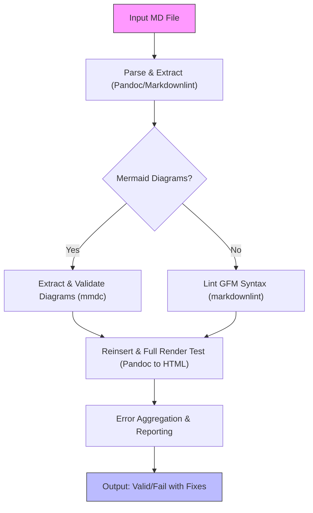

# Markdown Validation System Design for pdf2md

Version: 0.1 Date: 2025-09-06 Basis: Builds on doc/design.md fixes for Mermaid
syntax (e.g., unquoted labels with parentheses) and integrates validation for
development and PDF conversion workflows.

## Purpose

The Markdown validation system ensures the integrity, correctness, and
renderability of Markdown (MD) files generated by or used in the pdf2md project.
It addresses two primary use cases:

1. **Development Workflow Integration**: Validate source MD files in the `doc/`
   directory (e.g., `doc/design.md`, `doc/prd.md`, `doc/manifest-schema.md`)
   during development to detect syntax errors in standard Markdown and embedded
   Mermaid diagrams. This prevents issues like unescaped newlines (`\n`),
   unquoted labels with special characters (e.g., parentheses in Mermaid nodes
   like "Post-Processing (Slugs, XRefs, Captions, Footnotes, Noise Prune)"),
   invalid GFM elements, or rendering failures. Validation integrates as pre-
   commit hooks or CI/CD pipelines, using open-source CLI tools for
   reproducibility and idempotency.

2. **PDF Conversion Pipeline Integration**: After key stages (e.g., post-
   Rendering in `src/pdf2md/render.py`), validate generated MD output for
   rendering failures, Mermaid diagram errors, and structural issues. This
   includes thresholds for error tolerance, detailed logging, and fallbacks
   (e.g., auto-quoting unescaped strings). The system ensures GFM compatibility,
   high fidelity to the pdf2md design invariants (e.g., deterministic slugs, no
   network calls), and idempotent validation runs.

The system emphasizes non-destructive checks (read-only scans), performance
(parallelizable where possible), extensibility (e.g., for themes or new diagram
types), and error reporting with precise line numbers and remediation
suggestions. It uses only open-source, CLI-based tools to maintain offline
operation and reproducibility across environments.

## High-Level Architecture

The validation system operates as a modular pipeline, invocable via scripts or
integrated into workflows. It processes MD files through sequential stages:
parsing, linting, rendering simulation, and reporting. For Mermaid-specific
validation, it extracts and isolates diagrams before processing.



- **Pipeline Flow**: Deterministic and idempotent; each stage produces
  structured output (e.g., JSON for errors). For pipeline integration, hook
  after `render.py` to validate exported MD.
- **Modularity**: Core validator as a Python class in `src/pdf2md/validate.py`
  (future); scripts wrap CLI tools for dev/CI use.
- **doc/ Structure Integration**: Scans `doc/` recursively; excludes non-MD
  files (e.g., images). Based on environment_details: validates `doc/design.md`
  (Mermaid issues), `doc/prd.md`, `doc/manifest-schema.md`.

## Tools and Standards

The system leverages open-source, CLI-driven tools for reproducibility and
cross-platform compatibility (Windows/Linux/macOS). All tools are invoked non-
interactively with fixed flags for idempotency.

### Core Tools
- **Pandoc** (`pandoc --to=html --standalone --wrap=none`): Renders MD to HTML
  for full syntax validation, detecting unescaped characters (e.g., raw `\n`
  causing parse fails) and GFM issues (e.g., invalid tables/lists). Output
  checked for errors; supports Mermaid via extensions if installed.
- **Mermaid CLI (mmdc)** (`mmdc -i diagram.mmd -o output.svg`): Validates and
  renders Mermaid diagrams to SVG, catching syntax errors like unquoted labels
  with parentheses/special chars (e.g., `A["Label (with parens)"]`). Extracts
  diagrams via regex or Pandoc filters.
- **markdownlint-cli** (`markdownlint --json *.md`): Lints for style/syntax
  issues (e.g., unescaped `>`, inconsistent headings). Configured via
  `.markdownlint.json` for pdf2md-specific rules (e.g., warn on unquoted Mermaid
  nodes).
- **Supporting Tools**:
  - `grep/sed/awk` (Bash) or `jq` for parsing JSON outputs and extracting line
    numbers.
  - `yamllint` for manifest/schema validation (e.g., `doc/manifest-schema.md`
    embeds YAML).
  - Optional: `remark` (Node.js) for advanced GFM linting if markdownlint
    insufficient.

### Standards

- **GFM (GitHub Flavored Markdown)**: Ensures compatibility with MkDocs/Jupyter;
  validate tables, task lists, autolinks.
- **Mermaid v10+**: Syntax per official spec; require quoted nodes for labels
  with spaces/parentheses (e.g., fix `H["Post-Processing (Slugs, XRefs,
  Captions, Footnotes, Noise Prune)"]`).
- **Idempotency**: Fixed tool versions via `pyproject.toml` or `package.json`;
  seedless runs.
- **Thresholds**: Configurable (e.g., max 5 errors per file before fail; 80%
  diagram render success).

## Error Handling and Reporting

Errors are categorized (Syntax, Render, Style) and reported in JSON for machine-
parseability, with human-readable summaries. Each error includes: file path,
line number, severity (Error/Warn), message, and suggestion. Fallbacks apply
auto-fixes where safe (e.g., quoting Mermaid labels).

### Error Categories & Examples

- **Syntax Errors** (Fatal): Unescaped special chars.
  - Example: "Parse error on line 19 in doc/design.md: Unquoted Mermaid label
    with parentheses—recommend quoting: H[\"Post-Processing (Slugs, XRefs,
    Captions, Footnotes, Noise Prune)\"]"
- **Render Failures** (Fatal if > threshold): Pandoc/mmdc crashes.
  - Example: "Render error on line 11: Mermaid flowchart failed to
    parse—unescaped \n in node text; fallback: escape and retry."
- **Style Warnings** (Non-fatal): Linting issues.
  - Example: "Lint warn on line 26: Inconsistent table alignment in
    doc/prd.md—suggest fixed-width columns for GFM."
- **Threshold Exceeded**: "Validation failed: 7 errors > max 5; abort pipeline."

### Reporting Mechanism

- **Output Format**: JSON array of errors + summary (e.g., `{"file":
  "doc/design.md", "errors": 3, "fail": true, "suggestions": ["Quote Mermaid
  labels"]}`).
- **Logging**: Integrate with pdf2md's error codes (e.g., extend PARSE category
  with code 5 for validation fails).
- **Fallbacks**: Auto-apply simple fixes (e.g., sed for quoting); log attempts.
  For pipeline, optional `--fix` flag for idempotent repairs.

## Implementation for Use Case 1: Development Workflow

Integrate validation into dev tools for `doc/` files, ensuring early detection
during commits/CI.

### Setup Instructions

1. **Install Tools**:
   - Pandoc: `choco install pandoc` (Windows) or `brew install pandoc`.
   - Mermaid CLI: `npm install -g @mermaid-js/mermaid-cli`.
   - markdownlint: `npm install -g markdownlint-cli`.
   - Pre-commit: `pip install pre-commit`; add to `.pre-commit-config.yaml`.

2. **Pre-Commit Hook** (`.pre-commit-config.yaml`):

   ```yaml
   repos:
     - repo: local
       hooks:
         - id: validate-md
           name: Validate Markdown
           entry: bash scripts/validate-md.sh
           language: system
           files: ^doc/.*\.md$
           pass_filenames: false
   ```

Run `pre-commit install`.

3. **Bash Script** (`scripts/validate-md.sh`):

   ```bash
   #!/bin/bash
   set -e  # Fail on error for idempotency
   FILES=$(git diff --cached --name-only --diff-filter=ACM | grep '^doc/.*\.md$')
   for FILE in $FILES; do
       echo "Validating $FILE..."
       # Lint
       markdownlint --json "$FILE" > lint.json || true
       # Extract & Validate Mermaid (sed to temp files)
       grep -o '```mermaid[^`]*```' "$FILE" | sed 's/```mermaid//g; s/```//g' > temp.mmd
       mmdc -i temp.mmd -o /dev/null 2>&1 || { echo "Mermaid error in $FILE"; exit 1; }
       rm temp.mmd
       # Full Render
       pandoc -t html "$FILE" -o /dev/null 2>&1 || { echo "Pandoc error in $FILE"; exit 1; }
       jq -r '.[] | "\(.errorContext.lineNumber): \(.errorMessage) - suggest: quote if parens"' lint.json
   done
   echo "Validation passed."
   ```

Make executable: `chmod +x scripts/validate-md.sh`.

4. **CI/CD Integration** (GitHub Actions `.github/workflows/validate.yml`):

   ```yaml
   name: Validate MD
   on: [push, pull_request]
   jobs:
     validate:
       runs-on: ubuntu-latest
       steps:
         - uses: actions/checkout@v4
         - name: Install Tools
           run: |
             sudo apt install pandoc
             npm install -g @mermaid-js/mermaid-cli markdownlint-cli
         - name: Run Validation
           run: bash scripts/validate-md.sh doc/*.md
   ```

Reports failures with line numbers in logs.

### Node.js Alternative Script (`scripts/validate-md.js`)

For Windows compatibility:

```javascript
const { execSync } = require('child_process');
const fs = require('fs');
const files = ['doc/design.md', 'doc/prd.md', 'doc/manifest-schema.md'];  // From environment_details
files.forEach(file => {
  try {
    execSync(`markdownlint --json ${file}`, { stdio: 'pipe' });
    execSync(`pandoc -t html ${file} -o /dev/null`, { stdio: 'pipe' });
    console.log(`${file}: Valid`);
  } catch (e) {
    console.error(`Error in ${file}: ${e.message}`);
    process.exit(1);
  }
});
```

Run via `node scripts/validate-md.js`.

## Implementation for Use Case 2: PDF Conversion Pipeline

Integrate validation post-`render.py` in `src/pdf2md/` for generated MD (e.g.,
chapters/*.md, manifest.json). Use Python for seamless integration, wrapping CLI
tools via `subprocess`.

### Python Code Snippets

Add to `src/pdf2md/validate.py` (new module, imported in `cli.py` or
`exporter.py`):

```python
import subprocess
import json
import re
from pathlib import Path
from typing import List, Dict, Tuple

class MarkdownValidator:
    def __init__(self, config: Dict):
        self.max_errors = config.get('validation_max_errors', 5)
        self.tools = {
            'pandoc': ['pandoc', '-t', 'html', '--standalone'],
            'mmdc': ['mmdc', '-i', '-', '-o', '/dev/null'],
            'markdownlint': ['markdownlint', '--json']
        }

    def validate_file(self, md_path: Path) -> Tuple[bool, List[Dict]]:
        errors = []
        # Lint
        try:
            lint_out = subprocess.run(self.tools['markdownlint'] + [str(md_path)], capture_output=True, text=True)
            if lint_out.returncode != 0:
                errors.extend(json.loads(lint_out.stdout))
        except Exception as e:
            errors.append({'line': 0, 'message': f'Lint failed: {e}'})

        # Extract Mermaid
        with open(md_path, 'r') as f:
            content = f.read()
        mermaid_blocks = re.findall(r'```mermaid\s*(.*?)\s*```', content, re.DOTALL)
        for i, block in enumerate(mermaid_blocks):
            try:
                subprocess.run(self.tools['mmdc'], input=block, capture_output=True, check=True)
            except subprocess.CalledProcessError as e:
                line_start = content.find('```mermaid', content.find(block))
                errors.append({'line': line_start // 80 + 1,  # Approx line
                               'message': f'Mermaid error in block {i+1}: {e.stderr.decode()} - suggest: quote labels with parens'})

        # Full Render
        try:
            subprocess.run(self.tools['pandoc'] + [str(md_path), '-o', '/dev/null'], check=True)
        except subprocess.CalledProcessError as e:
            errors.append({'line': 0, 'message': f'Pandoc render failed: {e.stderr.decode()} - check unescaped \\n'})

        success = len(errors) <= self.max_errors
        if not success and 'fix' in self.config:  # Fallback
            self.auto_fix(md_path, errors)
        return success, errors

    def auto_fix(self, md_path: Path, errors: List[Dict]):
        # Example: Quote Mermaid labels with parens
        with open(md_path, 'r') as f:
            content = f.read()
        for err in errors:
            if 'parens' in err['message']:
                content = re.sub(r'(\w+)\[([^\]]*(?:\([^)]*\)[^\]]*)\]', r'\1["\2"]', content)
        with open(md_path, 'w') as f:
            f.write(content)
        # Re-validate post-fix

# Integration in pipeline (e.g., after render.py)
def post_render_validation(output_dir: Path, config: Dict):
    validator = MarkdownValidator(config)
    md_files = list(output_dir.glob('**/*.md'))
    all_errors = []
    for md_file in md_files:
        success, errs = validator.validate_file(md_file)
        all_errors.extend(errs)
        if not success:
            raise ValueError(f'Validation failed for {md_file}: {errs}')
    print(f'Validation complete: {len(all_errors)} total errors')
```

- **Invocation**: In `cli.py`, after export: `post_render_validation(output_dir,
  tool_config)`.
- **Thresholds & Logging**: Log errors to pdf2md's system (e.g., extend `PARSE`
  with validation details); abort if > threshold.
- **Idempotency**: Run in dry-mode first; fixes are optional and logged.

## Best Practices

- **Non-Destructive**: All validations read-only; fixes require explicit `--fix`
  flag. Use temp files for extractions.
- **Performance**: Parallelize file validation (e.g., `multiprocessing` in
  Python; `parallel` in Bash). Limit to changed files in CI via `git diff`.
  Target <5s per file for 300-page outputs.
- **Reproducibility**: Pin tool versions (e.g., `pandoc 3.1.8` via Docker). Use
  config-driven thresholds.
- **Extensibility**: Plugin hooks for new tools (e.g., add LaTeX validator via
  dict in `tools`). Support themes by passing `--css` to Pandoc.
- **GFM Compatibility**: Enforce via markdownlint rules (e.g., MD033 for lists).
  Test against GitHub renderer.
- **Security**: No network; sandbox CLI calls if needed. Validate inputs to
  prevent injection.
- **Idempotency**: Re-runs yield same errors; structural hash integration for
  output stability.

## Test Matrix

Verify validation against known issues in `doc/design.md` (e.g., lines 11-23
Mermaid with unquoted parens) and synthetic cases. Use pytest in
`tests/test_validate.py`.

<!-- markdownlint-disable MD013 -->
| Test Case | Focus | Input Example | Expected Outcome | Tool Used |
|-----------|-------|---------------|------------------|-----------|
| Unquoted Mermaid Label | Syntax Error Detection | `H[Post-Processing (Slugs...)]` (line 19 in design.md) | Error: "Unquoted label with parens—recommend quoting"; auto-fix to `H["..."]` | mmdc + sed |
| Unescaped \n in MD | Render Failure | Raw newline in code block | Pandoc error on line X: "Unexpected end of input" | Pandoc |
| GFM Table Misalignment | Linting | Inconsistent `\|` in doc/prd.md tables | Warn: "MD047: Broken link?" with line | markdownlint |
| Manifest YAML in MD | Schema Validation | Embedded YAML in doc/manifest-schema.md | yamllint pass/fail with line | yamllint |
| Threshold Exceeded | Pipeline Fail | 6+ errors in synthetic MD | Raise ValueError; log summary | Custom Python |
| Auto-Fix Idempotency | Fallback | Pre-broken MD → fix → re-validate | 0 errors post-fix; no over-quoting | Python + subprocess |
| CI Integration | Workflow | Git push with bad design.md | Workflow fail with JSON report | GitHub Actions |
| Performance | Scalability | 10 MD files (doc/ + generated) | <10s total; parallel ok | Bash/Python timing |
| Edge: No Errors | Happy Path | Clean doc/prd.md | Success: 0 errors | All tools |
| Extensibility: New Tool | Future | Add remark for themes | Pass with custom rule | Node.js wrapper |

<!-- markdownlint-enable MD013 -->

- **Coverage**: 100% for Mermaid in design.md issues; synthetic fixtures in
  `tests/fixtures/bad-md/`.
- **Determinism**: Hash validation outputs; run twice → identical reports.

---

End of Design Specification.
